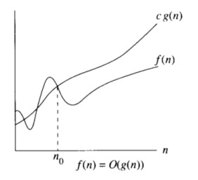
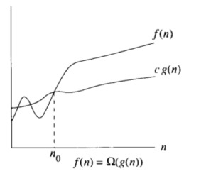
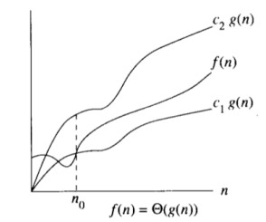
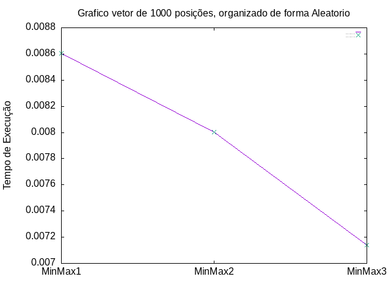
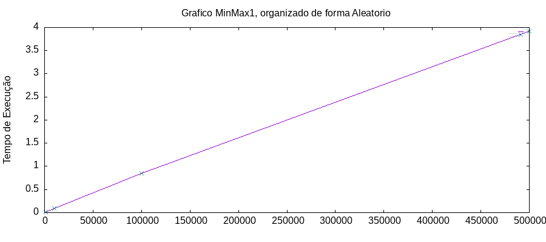
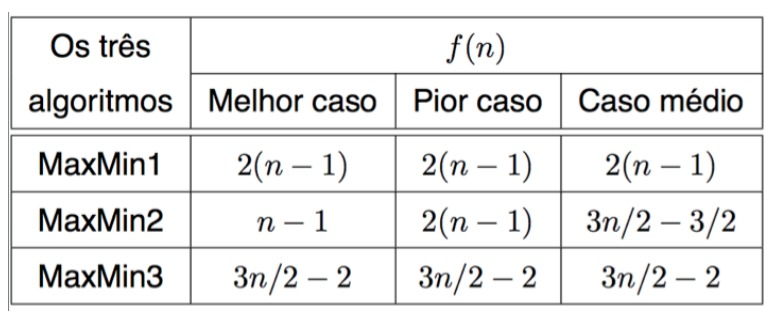
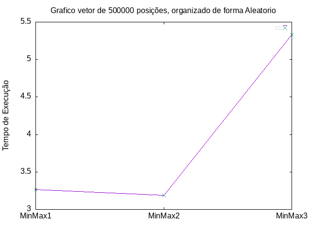
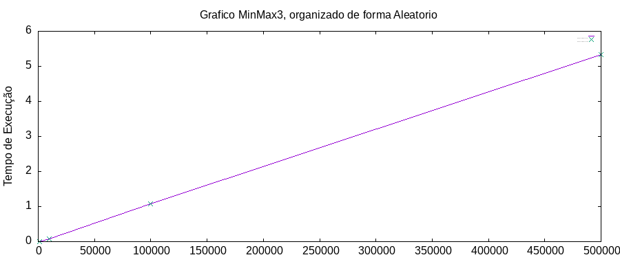

#  🎮 MinMax - Análise Assintótica

<div align="center">
   
   
   
   
</div>

<details>
  <summary>📌 Tópicos</summary>
    <ol>
        <li><a href="#-introdução">Introdução</a></li>
        <li><a href="#-análise-assintótica">Análise Assintótica</a></li>
        <li><a href="#-implementação">Implementação</a></li>
        <li><a href="#-estrutura-de-diretorios">Estrutura de Diretórios</a></li>
        <li><a href="#-como-usar">Como Usar</a></li>
        <li><a href="#-exemplos">Exemplos</a></li>
        <li><a href="#-resultados-das-análises">Resultados Das Análises</a></li>
        <li><a href="#-conclusão">Conclusão</a></li>
        <li><a href="#-ambiente-de-compilação">Ambiente de Compilação</a></li>
        <li><a href="#-makefile">MakeFile</a></li>
        <li><a href="#-contato">Contato</a></li>
        <li><a href="#-referências">Referências</a></li>
    </ol>
</details>

## 👋 Introdução 

A análise assintótica é uma técnica essencial em ciência da computação que nos permite entender o comportamento de algoritmos à medida que o tamanho do problema aumenta. Esta análise fornece insights valiosos sobre a eficiência e o desempenho dos algoritmos em diferentes cenários, o que é crucial para a otimização e a comparação entre algoritmos. Neste contexto, os algoritmos de MinMax desempenham um papel proeminente.

Os algoritmos de MinMax são amplamente utilizados em uma variedade de contextos computacionais, sendo especialmente proeminentes em jogos de estratégia de dois jogadores, como xadrez e jogo da velha. Sua essência reside em determinar a melhor jogada possível para um jogador, considerando todas as possíveis ações do oponente. Além de sua aplicação prática, uma compreensão profunda da análise assintótica desses algoritmos é fundamental.

Neste repositório, exploramos tanto a análise assintótica dos algoritmos de MinMax quanto sua importância na computação moderna. Ao fazê-lo, esperamos proporcionar uma compreensão abrangente desses algoritmos fundamentais e seu papel na otimização de algoritmos e na comparação entre eles.

## 📊 Análise Assintótica

Ao compreender a análise assintótica, podemos entender o desempenho e a eficiência desses algoritmos fundamentais. Por meio da análise cuidadosa do tempo de execução e uso de memória, podemos compreender como esses algoritmos se comportam à medida que o tamanho do problema cresce. Esta análise não apenas nos permite avaliar a eficiência dos algoritmos em diferentes cenários, mas também nos ajuda a comparar e selecionar o algoritmo mais adequado para uma determinada tarefa. 

### 👨‍💻 Análise de Algoritmos
A análise de algoritmos se concentra em entender, estudar e avaliar a correção e o desempenho dos algoritmos. Um algoritmo é uma sequência de passos bem definidos que resolve um problema específico. A análise de algoritmos busca responder perguntas como:

1. **Eficiência:** Quão rápido um algoritmo resolve um problema? Quanta memória ele consome?
2. **Escalabilidade:** Como o desempenho do algoritmo é afetado quando a entrada de dados cresce?
3. **Complexidade:** Qual é a complexidade do algoritmo? Isso significa quão difícil é compreendê-lo e implementá-lo.

A análise de algoritmos geralmente se concentra em duas medidas principais:

1. **Tempo de execução:** Isso envolve determinar quanto tempo um algoritmo leva para concluir, muitas vezes referido como "tempo de execução" ou "complexidade de tempo". Pode ser medido em termos de tempo real (segundos, milissegundos, etc.) ou em termos de operações fundamentais (como comparações ou movimentos de dados).

2. **Espaço de armazenamento:** Isso refere-se à quantidade de memória que um algoritmo consome durante sua execução, muitas vezes chamado de "complexidade de espaço". Isso pode incluir o espaço necessário para armazenar variáveis, estruturas de dados temporárias e quaisquer outras alocações de memória feitas pelo algoritmo.

Existem várias técnicas para analisar algoritmos:

1. **Análise teórica:** Isso envolve análise matemática e cálculos para determinar o tempo de execução e a complexidade de espaço do algoritmo. Isso geralmente é feito usando notações como a notação Big O, Theta e Omega.

2. **Experimentação prática:** Isso envolve implementar o algoritmo em um ambiente de programação e medir seu desempenho com entradas de dados de diferentes tamanhos. Embora menos preciso do que a análise teórica, pode ser útil para validar as previsões teóricas e fornecer informações sobre o desempenho do mundo real.

3. **Comparação empírica:** Isso envolve comparar o desempenho de diferentes algoritmos para o mesmo problema e determinar qual é mais eficiente em termos de tempo de execução e uso de memória.

### 🖋️ Notação Assintótica
A notação assintótica é uma ferramenta importante na análise de algoritmos e desempenho de programas. Ela nos permite descrever o comportamento de uma função à medida que sua entrada tende ao infinito. Isso é útil para entender como o tempo de execução de um algoritmo ou o uso de recursos (como memória) cresce conforme o tamanho do problema aumenta.

Existem três notações assintóticas comuns:

#### 📍 Notação O (Big O):
Isso descreve o limite superior do comportamento de uma função. Em termos simples, representa o pior cenário possível. Se uma função f(n) é O(g(n)), isso significa que, para valores suficientemente grandes de n, f(n) nunca crescerá mais rapidamente do que uma constante múltipla de g(n).

<p align="center">
    <b>0≤f(n)≤c∗g(n),∀n≥n0</b>

<figure align="center">
  
  <figcaption>Fonte: Autor</figcaption>
</figure>
</p>

#### 📍 Notação Ω (Big Omega)
Essa notação descreve o limite inferior do comportamento de uma função. Representa o melhor cenário possível. Se f(n) é Ω(g(n)), isso significa que, para valores suficientemente grandes de n, f(n) nunca crescerá mais lentamente do que uma constante múltipla de g(n).

<p align="center">
    <b>0≤c∗g(n)≤f(n),∀n≥n0</b>

<figure align="center">
  
  <figcaption>Fonte: Autor</figcaption>
</figure>
</p>

#### 📍 Notação Θ (Big Theta)
Esta notação descreve o comportamento exato de uma função. Se f(n) é Θ(g(n)), isso significa que f(n) cresce na mesma taxa que g(n) à medida que n tende ao infinito. Em outras palavras, f(n) é limitada superior e inferiormente por uma constante múltipla de g(n).

<p align="center">
    <b>0≤c1∗g(n)≤f(n)≤c2∗g(n),∀n≥n0</b>

<figure align="center">
  
  <figcaption>Fonte: Autor</figcaption>
</figure>
</p>


### 🚀 Aplicação da Análise Assintótica

Essas notações são úteis porque nos permitem expressar o desempenho de um algoritmo de forma concisa e independente de fatores específicos, como a velocidade do processador ou a quantidade exata de memória disponível. Elas nos ajudam a entender o comportamento geral de um algoritmo à medida que lidamos com entradas maiores, para projetar algoritmos eficientes e escaláveis.

A análise assintótica desempenha um papel crucial em uma variedade de contextos práticos, desde a otimização de algoritmos até o projeto de sistemas computacionais. No contexto deste trabalho, exploramos a aplicação da análise assintótica para compreender e comparar o desempenho de diferentes algoritmos de MinMax. 

Aqui, foi desenvolvido em C++ um programa que faz coleta dados de tempo de execução de três algoritmos diferentes para encontrar o maior e o menor valor de um vetor, de tamanhos diferentes e organizados de formas diferentes. Vamos primeiro enteder como foi implementado para depois discutimos os resultados. 

## 📝 Implementação

Este projeto consiste em um conjunto de funções em C++ que implementam três algoritmos diferentes para encontrar o valor máximo e mínimo em um vetor de inteiros. Os algoritmos são:

- **MaxMin1:** Este algoritmo percorre o vetor uma vez para encontrar o máximo e o mínimo.
- **MaxMin2:** Similar ao MaxMin1, mas utiliza uma estrutura de controle diferente para verificar o máximo e o mínimo.
- **MaxMin3:** Este algoritmo utiliza uma abordagem em anéis para encontrar o máximo e o mínimo.

Além da implementação dos algoritmos, o programa realiza uma análise de desempenho abrangente. Cada algoritmo é executado 10 vezes para cada combinação de tamanho de vetor (1000, 10000, 100000, 500000) e configuração de ordenação (aleatório, crescente, decrescente). Os tempos de execução são registrados e os resultados são armazenados em um arquivo CSV para posterior análise.

Posteriormente, são gerados gráficos a partir dos dados do arquivo CSV, permitindo uma visualização clara das diferenças de desempenho entre os algoritmos para diferentes cenários de entrada.

### 🔍 Algoritmos MinMax
Os algoritmos `MaxMin1`, `MaxMin2` e `MaxMin3` são implementados para resolver o problema de encontrar o máximo e o mínimo em um vetor de forma eficiente.

1. **MaxMin1:** O algoritmo `MaxMin1` percorre o vetor uma única vez para encontrar o valor máximo e mínimo. Ele inicializa as variáveis Max e Min com o valor do segundo elemento do vetor e, em seguida, percorre o restante do vetor comparando cada elemento com Max e Min e atualizando-os conforme necessário.
``` cpp
    void MaxMin2(int A[], int n, int &Max, int &Min) {
        Max = A[0];
        Min = A[0];

        for (int i = 1; i < n; i++) {
            if (A[i] > Max) {
                Max = A[i];
            } else if (A[i] < Min) {
                Min = A[i];
            }    <figure align="center">
    
    <figcaption>Fonte: Autor</figcaption>
    </figure>
        }
    }   
```

2. **MaxMin2:** O algoritmo `MaxMin2` é semelhante ao `MaxMin1`, mas utiliza uma estrutura de controle diferente. Ele também percorre o vetor uma única vez e compara cada elemento com Max e Min, mas utiliza uma estrutura if-else para verificar se o elemento é maior que Max ou menor que Min.
``` cpp
    void MaxMin2(int A[], int n, int &Max, int &Min) {
        Max = A[1];
        Min = A[1];
        for (int i = 1; i < n; i++) {
            if (A[i] > Max) {
                Max = A[i];
            } else if (A[i] < Min) {
                Min = A[i];
            }
        }
    }
```

3. **MaxMin:** O algoritmo MaxMin3 utiliza uma abordagem em anéis para encontrar o valor máximo e mínimo. Ele é projetado para lidar com vetores de tamanho ímpar e par de forma eficiente, garantindo que todos os elementos do vetor sejam comparados entre si.
``` cpp
    void MaxMin3(int A[], int n, int &Max, int &Min) {
        int i, FimDoAnel = 0;

        if (n % 2 > 0) {
            A[n] = A[n - 1];
            FimDoAnel = n;
        } else {
            FimDoAnel = n - 1;
        }

        if (A[0] > A[1]) {
            Max = A[0];
            Min = A[1];
        } else {
            Max = A[1];
            Min = A[0];
        }

        i = 2;
        while (i < FimDoAnel) {
            if (A[i] > A[i + 1]) {
                if (A[i] > Max) {
                    Max = A[i];
                }
                if (A[i + 1] < Min) {
                    Min = A[i + 1];
                }
            } else {
                if (A[i + 1] > Max) {
                    Max = A[i + 1];
                }
                if (A[i] < Min) {
                    Min = A[i];
                }
            }

            i += 2;
        }
    }
```

### ⏱️ Medição e Armazenamento do Tempo de Execução
Para avaliar o desempenho dos algoritmos de busca do valor máximo e mínimo em um vetor, foram realizadas medições precisas do tempo de execução. Essas medições foram feitas utilizando a biblioteca `<chrono>` do C++, que oferece uma maneira confiável de medir tempos em alta resolução. O tempo de execução de cada algoritmo foi medido em diferentes cenários, incluindo diferentes tamanhos de vetor e diferentes configurações de ordenação. Os resultados foram registrados em um arquivo CSV, fornecendo uma base de dados para análise detalhada do desempenho de cada algoritmo em diversas condições. A função `execucao` que está no arquivo `minMax.cpp` é responsável por realizar a execução dos algoritmos, medir o tempo de execução e armazenar os resultados.

1. **Definição de Variáveis e Loops Externos**
    - Nesta parte, são definidas as variáveis necessárias para controlar o tamanho do vetor (`n`), o tempo de execução médio (`tempoExecMedio`) e as strings para armazenar informações sobre a ordem do vetor e o algoritmo utilizado.

    - Em seguida, é iniciado um loop externo que percorre quatro diferentes tamanhos de vetores (1000, 10000, 100000, 500000). O valor de `n` é atualizado em cada iteração do loop de acordo com o tamanho do vetor atual.

    ```cpp
        void execucao(std::string arquivoSaida) {
            int n;
            int Max, Min;
            double tempoExecMedio;
            std::string ordem;
            std::string algoritmo; 
            std::ofstream outputFile(arquivoSaida);

            if(!outputFile.is_open()) {
                std::cerr << "Erro ao abrir o arquivo: " << arquivoSaida << std::endl;
                return;
            }

            std::cout << "Executando algoritmos..." << std::endl;
            for (int i = 0; i < 4; i++) {
                if(i == 0) {
                    n = 1000;
                } else if(i == 1) {
                    n = 10000;
                } else if(i == 2) {
                    n = 100000;
                } else if(i == 3) {
                    n = 500000;
                }
    ```

2. **Alocação e Ordenação do Vetor**
    - Dentro do loop externo, um novo vetor `A` é alocado dinamicamente com o tamanho determinado por `n`.

    - Em seguida, um loop interno percorre três diferentes tipos de organização do vetor: `Aleatório`, `Crescente` e `Decrescente`.

    - Inicialmente o vetor é preenchido com valores aleatórios, depois, dependendo do tipo de organização (`j`), ele é ordenado utilizando a função `std::sort`, de forma crescente e depois decrescente.

    ```cpp
            int* A = gerarVetor(n);
            for (int j = 0; j < 3; j++) { 
                if(j == 1) {
                    std::sort(A, A + n);
                } else if(j == 2) {
                    std::sort(A, A + n, std::greater<int>());
                }
    ```

3. **Execução dos Algoritmos e Medição do Tempo de Execução**
    - Dentro do loop interno, cada um dos três algoritmos (`MaxMin1`, `MaxMin2` e `MaxMin3`) é executado 10 vezes para cada tipo de organização do vetor.

    - O tempo de execução de cada execução é medido utilizando a biblioteca `<chrono>`.

    - Após a execução dos algoritmos, os resultados são então armazenados em um arquivo CSV (`resultados.csv`) junto com informações sobre o tamanho do vetor, a organização do vetor e o número do algoritmo.
   
    - Finalmente, a memória alocada para o vetor `A` é liberada antes de encerrar a função.

    ```cpp
                    for (int k = 0; k < 3; k++) { 
                    std::cout << "\n--------------------" << std::endl;
                    std::cout << "Tamanho do vetor: " << n << std::endl;
                    std::cout << "Ordem: " << ordem << std::endl;
                    std::cout << "Algoritmo: MinMax" << k+1 << std::endl << std::endl;
                    for (int l = 0; l < 10; l++) {
                        auto inicio = std::chrono::high_resolution_clock::now();
                        if(k == 0) {
                            MaxMin1(A, n, Max, Min);
                        } else if(k == 1) {
                            MaxMin2(A, n, Max, Min);
                        } else if(k == 2) {
                            MaxMin3(A, n, Max, Min);
                        }              
                        auto fim = std::chrono::high_resolution_clock::now();
                        std::chrono::duration<double, std::milli> tempoExec = (fim - inicio);

                        tempoExecMedio += tempoExec.count();
                        if (j == 0) {
                            ordem = "Aleatorio";
                        } else if (j == 1) {
                            ordem = "Crescente";
                        } else if (j == 2) {
                            ordem = "Decrescente";
                        }

                    outputFile << n << "," << ordem << "," << k+1 << "," << tempoExec.count() << "\n";
                    std::cout << "Execução " << l+1 << std::endl;
                    std::cout << "Tempo de execução: " << tempoExec.count() << " ms" << std::endl;
                    std::cout << "Max: " << Max << std::endl;
                    std::cout << "Min: " << Min << std::endl;
                    std::cout << std::endl;
                    }
                }
            }
            delete[] A;
        }

        
        std::cout << "Execução finalizada." << std::endl;
        std::cout << "\n-------------------------------" << std::endl;
        std::cout << "Resultados salvos em " << arquivoSaida << std::endl;
    }
    ```

4. **Cálculo das médias e reorganização do arquivo**
    - Foi criada uma função `resultadosMedias` para calcular a média, pegando os dados do arquivo `resultados.csv` e após o cálculo, a média é guardado no arquivo `resultadosMedias.csv`.

    ```cpp
    void resultadosMedias (std::string arquivoEntrada, std::string arquivoSaida) {
        std::ifstream inputFile(arquivoEntrada);
        std::ofstream outputFile(arquivoSaida);

        if (!inputFile || !outputFile) {
            std::cerr << "Erro ao abrir os arquivos." << std::endl;
            return;
        }

        std::string line;
        int count = 0;
        double sum = 0.0;
        std::string currentKey;
        while (std::getline(inputFile, line)) {
            std::stringstream ss(line);
            std::string token;
            std::string key;

            std::getline(ss, token, ',');
            key += token + ",";
            std::getline(ss, token, ',');
            key += token + ",";
            std::getline(ss, token, ',');
            key += token;

            if (std::getline(ss, token, ',')) {
                try {
                    double value = std::stod(token);
                    sum += value;
                    count++;
                    currentKey = key;  
                } catch (const std::invalid_argument& e) {
                    std::cerr << "Erro ao converter '" << token << "' para double." << std::endl;
                    return;
                }
            }

            if (count == 10 && currentKey == key) {
                double average = sum / 10.0;
                outputFile << currentKey << "," << std::fixed << std::setprecision(7) << average << std::endl;

                count = 0;
                sum = 0.0;
            }
        }

        inputFile.close();
        outputFile.close();
        std::cout << "Media calculada e salva em " << arquivoSaida << std::endl;
    }
    ```

    - Para uma melhor análise dos dados e para facilitar para plotar os gráficos, foi criada a função `reorganizacaoArquivoResultados` para reorganizar os dados de forma com que podemos visualizar cada MinMax separadamente e suas variações. 

    ```cpp
    void reorganizacaoArquivoResultados(std::string arquivoEntrada, std::string arquivoSaida) {
        std::ifstream inputFile(arquivoEntrada);    
        std::string MinMax11, MinMax21, MinMax31;
        std::string MinMax12, MinMax22, MinMax32;
        std::string MinMax13, MinMax23, MinMax33;

        if (!inputFile) {
            std::cerr << "Erro ao abrir arquivo de entrada." << std::endl;
            return;
        }

        std::string line;
        while (std::getline(inputFile, line)) {
            std::istringstream ss(line);
            std::string token;
            std::vector<std::string> tokens;
            int ordem;
            
            while (std::getline(ss, token, ',')) {
                tokens.push_back(token);
            }

            int numeroColuna3 = std::stoi(tokens[2]);
            std::string coluna2 = tokens[1];
            if (numeroColuna3 == 1 && coluna2 == "Aleatorio") {
            MinMax11 += line + "\n";
            } else if (numeroColuna3 == 2 && coluna2 == "Aleatorio") {
                MinMax12 += line + "\n";
            } else if (numeroColuna3 == 3 && coluna2 == "Aleatorio") {
                MinMax13 += line + "\n";
            } else if (numeroColuna3 == 1 && coluna2 == "Crescente") {
                MinMax21 += line + "\n";
            } else if (numeroColuna3 == 2 && coluna2 == "Crescente") {
                MinMax22 += line + "\n";
            } else if (numeroColuna3 == 3 && coluna2 == "Crescente") {
                MinMax23 += line + "\n";
            } else if (numeroColuna3 == 1 && coluna2 == "Decrescente") {
                MinMax31 += line + "\n";
            } else if (numeroColuna3 == 2 && coluna2 == "Decrescente") {
                MinMax32 += line + "\n";
            } else if (numeroColuna3 == 3 && coluna2 == "Decrescente") {
                MinMax33 += line + "\n";
            }
        }

        inputFile.close();

        std::ofstream outputFile(arquivoSaida);
        if (!outputFile.is_open()) {
            std::cerr << "Erro ao abrir arquivo de saída." << std::endl;
            return;
        }

        outputFile <<  MinMax11 <<  MinMax21 <<  MinMax31 <<  MinMax12 <<  MinMax22 <<  MinMax32 <<  MinMax13 <<  MinMax23 <<  MinMax33;

        outputFile.close();
        std::cout << "Reorganizacao dos dados para outra analise salva em " << arquivoSaida << std::endl;
    }
    ```

    - Depois é calculada a média novamente, porém usando como entrada esse novo arquivo reorganizado. 

## 📈 Geração de Gráficos Gnuplot
A geração de gráficos é uma etapa crucial para visualizar e interpretar os resultados obtidos a partir da execução dos algoritmos. Isso é feito utilizando uma ferramenta de plotagem, como o Gnuplot. O processo envolve as seguintes etapas:

### 📊 Primeiro tipo plotagem 
1. **Arquivo resultadosMedias.csv:** O arquivo `resultadosMedias.csv` é um arquivo CSV (Comma-Separated Values) que armazena os resultados da execução dos algoritmos em diferentes cenários. Cada linha do arquivo contém dados relacionados a uma execução específica do algoritmo, e os dados são organizados da seguinte forma:

    - *Tamanho do vetor (`n`):* Representa o tamanho do vetor utilizado na execução do algoritmo.
    
    - *Tipo de organização do vetor:* Indica se o vetor foi organizado de forma aleatória, crescente ou decrescente.

    - *Número do algoritmo:* Identifica qual algoritmo foi executado. No exemplo fornecido, os valores possíveis são 1, 2 e 3, correspondendo aos algoritmos `MaxMin1`, `MaxMin2` e `MaxMin3`, respectivamente.
    
    - *Tempo de execução médio:* Representa o tempo médio de execução do algoritmo, medido em segundos.

2. **Código para Geração de Gráficos (plotGraficoMedias.gp):** Para uma análise visual dos resultados obtidos a partir da execução dos algoritmos, são gerados gráficos que representam o tempo de execução em diferentes cenários. Esses gráficos são gerados a partir dos dados contidos no arquivo `resultadosMedias.csv`, onde cada linha representa uma execução específica dos algoritmos.

    - *Definição do Terminal de Saída:* O código define o formato de saída dos gráficos como PNG.

    - *Determinação do Número Total de Linhas no Arquivo:* Utiliza o comando do sistema `wc` para contar o número total de linhas no arquivo `resultadosMedias.csv`. Isso permite determinar quantos gráficos serão gerados.
        ```gnuplot
        set terminal png

        # Número de linhas a serem plotadas em cada gráfico
        linhas_por_grafico = 3

        # Número total de linhas no arquivo
        total_linhas = system('wc -l < "../datasets/resultadosMedias.csv"')
        ```
    - *Definição da Função para Plotar os Dados:* A função `plotarDados` é responsável por gerar um script Gnuplot para plotar os dados de tempo de execução em um gráfico. Ela recebe vários parâmetros que são essenciais para a criação do script Gnuplot:
        - `linha_inicial`: Representa a linha inicial dos dados a serem plotados.
        - `linha_final`: Representa a linha final dos dados a serem plotados.
        - `indice`: Índice do gráfico, utilizado para identificar cada gráfico gerado.
        - `n`: Tamanho do vetor utilizado na execução do algoritmo.
        - `tipo`: Tipo de organização do vetor (aleatório, crescente, decrescente).
        ```gnuplot
            # Define a função para plotar os dados 
            plotarDados(linha_inicial, linha_final, indice, n, tipo) = sprintf("set terminal png\nset output '../images/plots/%s/graficoMedia%s.png'\nset datafile separator \",\"\nset title \"Grafico vetor de %s posições, organizado de forma %s\"\nset xlabel \" \"\nset ylabel \"Tempo de Execução\"\nset xtics (\"MinMax1\" 1, \"MinMax2\" 2, \"MinMax3\" 3)\nset key font \"Arial, 1\"\nplot \"../datasets/resultadosMedias.csv\" every ::%d::%d using 3:4 with lines title \"Tempo de Execução - Linhas\", '' every ::%d::%d using 3:4 with points title \"Tempo de Execução - Pontos\"", tipo, n, n, tipo, linha_inicial, linha_final, linha_inicial, linha_final)

        ```

        A função então utiliza esses parâmetros para formatar um script Gnuplot que plota os dados correspondentes ao intervalo de linhas especificado. Ela define vários parâmetros do gráfico, como título, rótulos dos eixos e estilo das linhas.
        - Exemplo de Script Gnuplot Gerado pela função `plotarDados`:
            - O gráfico é salvo como `graficoMedia1.png` na pasta `../images/plots/Aleatorio/`.
            - Os dados são lidos do arquivo `resultadosMedias.csv` e apenas as linhas de 0 a 2 são consideradas.
            - O gráfico tem um título descritivo, rótulos nos eixos x e y, e um rótulo adicional explicando o contexto dos dados.
            - As linhas de dados são plotadas com estilo de linha contínua.
            ```gnuplot
            set terminal png
            set terminal png
            set output '../images/plots/Aleatorio/graficoMedia1000.png'
            set datafile separator ","
            set title "Grafico vetor de 1000 posições, organizado de forma Aleatorio"
            set xlabel " "
            set ylabel "Tempo de Execução"
            set xtics ("MinMax1" 1, "MinMax2" 2, "MinMax3" 3)
            set key font "Arial, 1"
            plot "../datasets/resultadosMedias.csv" every ::0::2 using 3:4 with lines title "Tempo de Execução - Linhas", '' every ::0::2 using 3:4 with points title "Tempo de Execução - Pontos"
            ``` 

    - *Loop para Geração de Scripts e Gráficos:* Um loop percorre o arquivo `resultadosMedias.csv` em incrementos de linhas. Para cada conjunto de dados, um script Gnuplot é gerado chamando a função `plotarDados`.

        1. *Definição do Intervalo de Linhas:* este loop percorre o intervalo de valores de `linha`, iniciando em 0 e indo até `total_linhas-linhas_por_grafico`, avançando de `linhas_por_grafico` em `linhas_por_grafico`. Cada iteração do loop processará um conjunto de linhas de dados do arquivo `resultados.csv`.
            ```gnuplot
                do for [linha = 0:total_linhas-linhas_por_grafico:linhas_por_grafico] {
            ``` 

        2. *Obtenção dos Dados:* Para cada iteração do loop, é determinada a linha inicial `linha_dados` a partir do valor de `linha`. Em seguida, são obtidos os dados relevantes para a geração do gráfico a partir do arquivo `resultados.csv`. O tamanho do vetor `n` e o tipo de organização do vetor `tipo` são extraídos da linha especificada.
            ```gnuplot
                linha_dados = linha + 1  # A linha dos dados na planilha começa do 1, não do 0
                n = system(sprintf("awk -F',' 'NR==%d{print $1}' ../datasets/resultadosMedias.csv", linha_dados))
                tipo = system(sprintf("awk -F',' 'NR==%d{print $2}' ../datasets/resultadosMedias.csv", linha_dados))
            ``` 
        
        3. *Cálculo dos Índices e do Nome do Script:*  São calculadas a linha inicial `linha_inicial` e a linha final `linha_final` do conjunto de dados a ser plotado. O índice do gráfico `indice` é calculado com base no número de linhas por gráfico. Além disso, é gerado um nome único para o script Gnuplot correspondente ao gráfico atual.
            ```gnuplot
                linha_inicial = linha
                linha_final = (linha -1) + linhas_por_grafico
                indice = linha / linhas_por_grafico + 1
                script_nome = sprintf("script_%d.gp", indice)
            ``` 

        4. *Gerção do Script Gnuplot:* A função `plotarDados` é chamada para gerar o script Gnuplot específico para o conjunto de dados atual. Esta função cria um script formatado com base nos parâmetros fornecidos.
            ```gnuplot
                script = plotarDados(linha_inicial, linha_final, indice, n, tipo)
            ``` 

        5. *Impressão do Script em um Arquivo:* O script Gnuplot gerado é impresso em um arquivo com o nome correspondente ao `script_nome`.
            ```gnuplot
                set print script_nome
                print script
                set print
            ``` 

        6. *Execução do Script Gnuplot:* O script Gnuplot é executado pelo Gnuplot, o que resulta na geração do gráfico correspondente ao conjunto de dados processado.
            ```gnuplot
                system(sprintf("gnuplot %s", script_nome))
            ``` 

    - *Limpeza dos Scripts Gerados:* Após a geração dos gráficos, os scripts Gnuplot gerados são removidos para manter a organização do ambiente de trabalho. 
        ```gnuplot
            # Apaga os scripts gerados após a execução
            system("rm script_*.gp")    
        ``` 


### 📊 Segundo tipo plotagem 
1. **Arquivo resultadosMinMaxMedias.csv:** Assim como o anterior, os dados são buscados no arquivo `resultadosMinMaxMedias.csv`, e tem a mesma organização dos dados nas colunas (tamanho do vetor, tipo de organização do vetor, número do algoritmo, tempo de execução médio). O que difere ele do arquivo `resultadosMedias.csv` é a como é organizado em linhas. Neste é colocado em ordem dos Algoritmos (`MaxMin1`, `MaxMin2` e `MaxMin3`), já no outro foi colocado como predominancia de organização os tamanhos dos vetores (1000, 10000, 100000, 500000). 

2. **Código para Geração de Gráficos (plotGraficoMinMax.gp):** Aqui também segue o mesmo padrão do outro script, tendo poucas adaptações. Segue as diferenças: 

    - *Determinação do Número Total de Linhas no Arquivo:* São pegas a 4 linhas do arquivo `resultadosMinMaxMedias.csv` para plotar cada gráfico. São 4 porque são os 4 tipos de tamanhos de vetores diferentes. 

    - *Definição da Função para Plotar os Dados:* A função `plotarDados` também permanece aq, porém com algumas mudanças. No lugar do paretro `n`, foi colocadoo parâmetro `algoritmo`, que irá identificar qual `MinMax` está sendo usado.  

        - Exemplo de Script Gnuplot Gerado pela função `plotarDados` do script `plotGraficoMinMax.gp`:
            - O gráfico é salvo como `graficoMinMax1.png` na pasta `../images/plots/Aleatorio/`.
            - Os dados são lidos do arquivo `resultadosMinMaxMedias.csv` e apenas as linhas de 0 a 3 são consideradas.
            - O gráfico tem um título descritivo, rótulos nos eixos x e y, e um rótulo adicional explicando o contexto dos dados.
            - As linhas de dados são plotadas com estilo de linha contínua.
            ```gnuplot
            set terminal png size 900,400
            set output '../images/plots/Aleatorio/graficoMinMax1.png'
            set datafile separator ","
            set title "Grafico MinMax1, organizado de forma Aleatorio"
            set xlabel " "
            set ylabel "Tempo de Execução"
            set key font "Arial, 1"
            plot "../datasets/resultadosMinMaxMedias.csv" every ::0::3 using 1:4 with lines title "Tempo de Execução - Linhas", '' every ::0::3 using 1:4 with points title "Tempo de Execução - Pontos"

            ``` 

    - *O Script:* Segue abaixo o script completo `plotarGraficoMinMax.gp`: 
    ```gnuplot
        set terminal png

        # Número de linhas a serem plotadas em cada gráfico
        linhas_por_grafico = 4

        # Número total de linhas no arquivo
        total_linhas = system('wc -l < "../datasets/resultadosMinMaxMedias.csv"')

        # Define a função para plotar os dados de acordo com os parâmetros passados
        plotarDados(linha_inicial, linha_final, indice, algoritmo, tipo) = sprintf("set terminal png size 900,400\nset output '../images/plots/%s/graficoMinMax%s.png'\nset datafile separator \",\"\nset title \"Grafico MinMax%s, organizado de forma %s\"\nset xlabel \" \"\nset ylabel \"Tempo de Execução\"\nset key font \"Arial, 1\"\nplot \"../datasets/resultadosMinMaxMedias.csv\" every ::%d::%d using 1:4 with lines title \"Tempo de Execução - Linhas\", '' every ::%d::%d using 1:4 with points title \"Tempo de Execução - Pontos\"", tipo, algoritmo, algoritmo, tipo, linha_inicial, linha_final, linha_inicial, linha_final)

        # Gera um script para cada conjunto de linhas
        do for [linha = 0:total_linhas-linhas_por_grafico:linhas_por_grafico] {
            linha_dados = linha + 1  # A linha dos dados na planilha começa do 1, não do 0
            algoritmo = system(sprintf("awk -F',' 'NR==%d{print $3}' ../datasets/resultadosMinMaxMedias.csv", linha_dados))
            tipo = system(sprintf("awk -F',' 'NR==%d{print $2}' ../datasets/resultadosMinMaxMedias.csv", linha_dados))
            
            linha_inicial = linha
            linha_final = (linha -1) + linhas_por_grafico
            indice = linha / linhas_por_grafico + 1
            script_nome = sprintf("script_%d.gp", indice)
            script = plotarDados(linha_inicial, linha_final, indice, algoritmo, tipo)
            set print script_nome
            print script
            set print
            # Executa o script gerado
            system(sprintf("gnuplot %s", script_nome))
        }

        # Apaga os scripts gerados após a execução
        system("rm script_*.gp")
    ```

## 📂 Estrutura de Diretórios

O projeto é organizado da seguinte forma:

```<figure align="center">
  
  <figcaption>Fonte: Autor</figcaption>
</figure>
│   │   |   └── app
├── datasets
│   │   ├── resultados.csv
│   │   ├── resultadosMedias.csv
│   │   ├── resultadosMinMax.csv
│   │   └── resultadosMinMaxMedias.csv
├── images
│   │   ├── imgs_readme
│   │   |   ├── minMax.o
│   │   |   └── main.o
│   │   ├── plots
│   │   |   ├── Aleatorio
│   │   |   |   ├── graficoMedia1000.png
│   │   |   |   ├── graficoMedia10000.png
│   │   |   |   ├── graficoMedia100000.png
│   │   |   |   ├── graficoMedia500000.png
│   │   |   |   ├── graficoMinMax1.png
│   │   |   |   ├── graficoMinMax3.png
│   │   |   |   └── graficoMinMax3.png
│   │   |   ├── Crescente
│   │   |   |   ├── graficoMedia1000.png
│   │   |   |   ├── graficoMedia10000.png
│   │   |   |   ├── graficoMedia100000.png
│   │   |   |   ├── graficoMedia500000.png
│   │   |   |   ├── graficoMinMax1.png
│   │   |   |   ├── graficoMinMax3.png
│   │   |   |   └── graficoMinMax3.png
│   │   |   └── Decrescente
│   │   |   |   ├── graficoMedia1000.png
│   │   |   |   ├── graficoMedia10000.png
│   │   |   |   ├── graficoMedia100000.png
│   │   |   |   ├── graficoMedia500000.png
│   │   |   |   ├── graficoMinMax1.png
│   │   |   |   ├── graficoMinMax3.png
│   │   |   |   └── graficoMinMax3.png
├── src
│   │   ├── main.cpp
│   │   ├── minMax.cpp
│   │   ├── minMax.hpp
│   │   ├── plotGraficoMedias.gp
│   │   └── plotGraficoMinMax.gp
├── makefile
└── README.md
```
Esta estrutura de diretórios facilita a organização do projeto e a localização dos arquivos necessários para compilar o código-fonte, executar o programa e visualizar os resultados.

## 📚 Como Usar

1. Clone este repositório:

    ```bash
    git clone https://github.com/dudatsouza/minMax.git

2. Antes de compilar o programa, é recomendado executar o comando `make clean` para garantir que todos os arquivos compilados anteriores sejam removidos:

    ```bash
    make clean
    ```

3. Em seguida, compile o programa usando o Makefile:

    ```bash
    make
    ```

4. Execute o programa, fornecendo o nome do arquivo de entrada:

    ```bash
    make run 
    ```

5. Os gráficos gerados serão salvos na pasta `plots`. Você pode visualizá-los para analisar o desempenho dos algoritmos para diferentes tamanhos de vetores e organizações.

## 📋 Exemplos

### 📄 Arquivos de entradas:
Os arquivos de entradas vc pode está pegando de exemplos os que estão disponíveis na pasta `/datasets`. Lá você vai encontrar os arquivos: 
- `resultados.csv`
- `resultadosMedias.csv`
- `resultadosMinMax.csv`
- `resultadosMinMaxMedias.csv`


### 📄 Exemplo de Saída de um dos Gráficos:
1. **Primeiro tipo de plotagem:** 
A partir do script `plotGaficoMedias.gp` são plotados 12 gráficos, cada um pegando a diferença entre o tempo de execução dos três MaxMin. Aqui está um exemplo de um dos gráficos gerados a partir dos dados do arquivo `resultadosMedias.csv`: 
<p align="center">
    <figure align="center">
    
    <figcaption>Fonte: Autor</figcaption>
    </figure>
</p>

**OBSERVAÇÃO:** Foram plotados um total de 12 gráficos, representando diferentes tamanhos de vetores e organizações, mostrando a variação do tempo de execução de acordo com o MinMax usado.

2. **Segundo tipo de plotagem:** 
A partir do script `plotGaficoMinMax.gp` são plotados 9 gráficos, cada um pegando a diferença entre o tempo de execução de acordo com o tamanho do vetor. Aqui está um exemplo de um dos gráficos gerados a partir dos dados do arquivo `resultadosMiinMaxMedias.csv`: 
<p align="center">
    <figure align="center">
    
    <figcaption>Fonte: Autor</figcaption>
    </figure>
</p>

**OBSERVAÇÃO:** Foram plotados um total de 9 gráficos, representando diferentes organizações e MinMaxs usados, mostrando a variação do tempo de execução de acordo com o tamanho do vetor.

## 📈 Resultados das Análises
Analisamos o desempenho de três diferentes implementações de algoritmos MinMax em uma série de cenários de teste. Ao examinar os resultados, procuramos identificar padrões de desempenho, vantagens e limitações de cada abordagem.

### 1️⃣ Algoritmo MaxMin1

- **Melhor Caso:** Ocorre quando o array está ordenado de forma crescente ou decrescente. Cada elemento é comparado uma vez com o próximo, resultando em \( n - 1 \) comparações. Como o algoritmo precisa encontrar tanto o máximo quanto o mínimo, são realizadas duas comparações para cada elemento. Portanto, \( f(n) = 2(n - 1) \).
  
- **Pior Caso:** Ocorre quando o array está ordenado de forma que o maior elemento esteja no início e o menor no final (ou vice-versa). Nesse caso, cada elemento é comparado com ambos o máximo e o mínimo, resultando em \( 2(n - 1) \) comparações. Portanto, \( f(n) = 2(n - 1) \).
  
- **Caso Médio:** O comportamento médio é semelhante ao pior caso, pois as comparações são feitas de maneira semelhante. Portanto, \( f(n) = 2(n - 1) \).

### 2️⃣ Algoritmo MaxMin2

- **Melhor Caso:** Ocorre quando o array está ordenado de forma crescente. Apenas o primeiro elemento é comparado com o máximo e o mínimo, resultando em \( n - 1 \) comparações. Portanto, \( f(n) = n - 1 \).
  
- **Pior Caso:** Ocorre quando o array está ordenado de forma decrescente. Cada elemento é comparado com ambos o máximo e o mínimo, resultando em \( 2(n - 1) \) comparações. Portanto, \( f(n) = 2(n - 1) \).
   
- **Caso Médio:** Considerando um conjunto de dados em que haverá \( (n - 1) \) passagens no primeiro "if" e \( (n - 1) / 2 \) no "else", resultando em \( f(n) = (n - 1) + (n - 1) / 2 = (3n / 2) - (3 / 2) \).

### 3️⃣ Algoritmo MaxMin3

- **Melhor, Pior e Caso Médio:** Neste algoritmo, os elementos são avaliados em pares, resultando em \( \frac{n}{2} \) comparações. O maior elemento é obtido pelo primeiro "if" com um custo de \( (n / 2) - 1 \) comparações, enquanto o menor é obtido pelo segundo "if" com um custo de \( (n / 2) - 1 \) comparações. Portanto, o custo total é \( f(n) = (n / 2) + (n - 2) / 2 + (n - 2) / 2 = (3n / 2) - 2 \).

Observe a imagem abaixo, onde mostra exatamente isso que acabamos de discutir: 
<p align="center">
    <figure align="center">
    
    <figcaption>Fonte: Autor</figcaption>
    </figure>
</p>


### 📊 Visualizando a teoria na prática
Aqui exploraremos os resultados práticos obtidos a partir da execução do programa, a fim de visualizar como os dados se relacionam com as análises teóricas dos algoritmos MinMax.

#### 📈 Olhando os gráficos plotados pelo script `plotGraficosMedias.gp`
Foi possível ver nos gráficos gerados pelo script `plotGraficoMedias.gp`o andamento e exatamente acontecendo o que foi explicado e analisado anteriormente.

Uma das coisas observadas foi que apesar da análise teórica indicar um custo de (3n / 2) - 2 para o algoritmo MinMax3 em todos os casos, ele parece apresentar um desempenho inferior em comparação com os outros algoritmos, especialmente quando os dados são aleatórios.

**Exemplo de Análise:** Olhando para o seguinte gráfico de umas das execuções podemos ver isso acontecendo: 
<p align="center">
    <figure align="center">
    
    <figcaption>Fonte: Autor</figcaption>
    </figure>
</p>

Usando dados aleatórios: 
- *Algoritmo MaxMin1:* f(n) = 2(n - 1)
- *Algoritmo MaxMin2:* f(n) = 2(n - 1)
- *Algoritmo MaxMin3:* f(n) = (3n / 2) - 2


Observamos que, ao usar conjuntos de dados aleatórios, os algoritmos MaxMin1 e MaxMin2 geralmente superam o algoritmo MaxMin3 em termos de tempo de execução. Isso é surpreendente, considerando que o custo teórico do algoritmo MinMax3 é o menor que o dos outros algoritmos.

##### 🤔 **Possíveis Explicações:**

1. **Padrão de Acesso à Memória:** É possível que o algoritmo MinMax3 tenha um padrão de acesso à memória menos favorável, o que pode impactar negativamente seu desempenho em sistemas reais.

2. **Características dos Dados de Entrada:** Os dados aleatórios podem não ser ideais para o algoritmo MinMax3, especialmente se eles não seguirem um padrão específico que o algoritmo possa explorar para otimizar sua execução.

Embora a análise teórica forneça uma estimativa do desempenho dos algoritmos, os resultados experimentais destacam a importância de validar essas previsões na prática. As discrepâncias observadas entre os resultados teóricos e práticos podem oferecer perspectivas para investigações e otimizações dos algoritmos.

#### 📈 Olhando os gráficos plotados pelo script `plotGraficosMinMax.gp`
Agora, quando analisamos os gráficos gerados pelo script `plotGraficosMinMax.gp`, vemos de uma outra maneira as aplicações das análises que nós fizemos. Lá mostra individualmente o desencolcimento de cada algoritmo MinMax. Percebemos que todos crescem de forma linar como nas nossa conclusões teóricas, mesmo que os gráficos não geram uma linha perfeita, até porque eles são plotados pela médias de várias execuções, no entanto temos que considerar também as margens de erros e situações diferentes de cada execução. 

**Exemplo de Análise:** Olhando para o seguinte gráfico de umas das execuções podemos ver isso acontecendo: 
<p align="center">
    <figure align="center">
    
    <figcaption>Fonte: Autor</figcaption>
    </figure>
</p>

##### 🤔 **Possíveis Explicações:**

1. **Variações na Carga do Sistema:** Durante as diferentes execuções do programa, pode haver variações na carga do sistema, como outros processos em execução no computador, que podem afetar o desempenho do programa. Essas variações podem contribuir para as diferenças nos resultados observados, mesmo quando se calculam médias.

2. **Efeito de Cache e Memória:** Os resultados práticos podem ser afetados pelo comportamento de cache e pelo acesso à memória do sistema. Pequenas variações no acesso à memória, como a localidade dos dados ou a ocorrência de falhas de cache, podem causar diferenças nos tempos de execução, mesmo para os mesmos conjuntos de dados.

Portanto, ao interpretar os gráficos e analisar o desempenho dos algoritmos, é essencial estar ciente desses fatores e considerar como eles podem influenciar a precisão das conclusões tiradas a partir dos resultados experimentais.

## 🎉 Conclusão 
Neste trabalho, foi explorado os algoritmos de MinMax teoricamente e experimentalmente. Enquanto as análises teóricas forneceram previsões úteis, os resultados práticos destacaram diferenças significativas. Observamos que o desempenho dos algoritmos foi influenciado por variações nos dados de entrada e outros fatores práticos. Essas descobertas destacam a importância de uma abordagem integrada ao estudar algoritmos, combinando análises teóricas com experimentos práticos para uma compreensão mais completa de seu comportamento.

## 🔨 Ambiente de Compilação

A seguir estão os detalhes do ambiente de compilação onde o programa foi executado:

| Componente      | Detalhes                          |
|-----------------|-----------------------------------|
| Sistema Operacional | Ununtu 22.04.4 LTS  - 64 bits|
| Modelo do hardware| Dell Inc. Inspiron 3501|
| Processador     | Intel® Core™ i3-1005G1 CPU @ 1.20GHz × 4|
| Memória RAM     | 8 GB, 1 de 8 GB, DDR4, 2.666 MHz|
| Armazenamento   | 256 GB, M.2 2230, PCIe NVMe de 3ª geração x4, SSD|
| IDE             | Visual Studio Code|

Observação: Os detalhes acima são baseados no ambiente de compilação utilizado durante o desenvolvimento do programa e podem variar em diferentes sistemas.


## ⛏ Makefile

O Makefile é um utilitário que automatiza o processo de compilação e execução de programas. Aqui estão os principais comandos do Makefile para este projeto:

| Comando      | Descrição                               |
|--------------|-----------------------------------------|
| `make`       | Compila o programa.                     |
| `make run`   | Executa o programa com o arquivo de entrada fornecido. |
| `make clean` | Remove os arquivos compilados.          |


## 📧 Contato

Para mais informações ou sugestões, sinta-se à vontade para entrar em contato:

- ✉️ **E-mail**: [](mailto:dudateixeirasouza@gmail.com)
- 💼 **LinkedIn**: [](https://www.linkedin.com/in/maria-eduarda-teixeira-souza-2a2b3a254/)
- 📸 **Instagram**: [](https://www.instagram.com/dudat_18/)

Ficarei feliz em receber feedbacks, contribuições ou responder a quaisquer dúvidas que você possa ter sobre o programa. 

## 🔖 Referências
1. João Arthur. **Análise Assintótica**. Disponível em: [https://joaoarthurbm.github.io/eda/posts/analise-assintotica/](https://joaoarthurbm.github.io/eda/posts/analise-assintotica/). Acesso em: 12 abr. 2024.

2. Pereira, F. **Análise de Algoritmos**. Disponível em: [https://www.ime.usp.br/~pf/analise_de_algoritmos/](https://www.ime.usp.br/~pf/analise_de_algoritmos/). Acesso em: 12 abr. 2024.

3. XVI ENID. **PROLICEN: Engenharia de Software: análise de complexidade assintótica de algoritmos**. Disponível em: [http://www.prac.ufpb.br/enex/XVENID/PROLICEN/CCAE/25.pdf](http://www.prac.ufpb.br/enex/XVENID/PROLICEN/CCAE/25.pdf). Acesso em: 12 abr. 2024.

4. Hokama. **CIC110 - Estrutura de Dados - Análise Assintótica**. Disponível em: [https://hokama.com.br/disciplinas/cic110_2019s2/02-analise-assintotica.pdf](https://hokama.com.br/disciplinas/cic110_2019s2/02-analise-assintotica.pdf). Acesso em: 12 abr. 2024.

5. Martins, A. **Análise de Complexidade de Algoritmos**. Disponível em: [http://www.deinf.ufma.br/~acmo/grad/ED_complexidade_2005.pdf](http://www.deinf.ufma.br/~acmo/grad/ED_complexidade_2005.pdf). Acesso em: 12 abr. 2024.

6. Reinaldo. **Análise de Algoritmos (Parte 3)**. Disponível em: [http://www.decom.ufop.br/reinaldo/site_media/uploads/2014-01-bcc202/aulas/aula_06_-_analise_de_algoritmos_(parte_3)_(v1).pdf](http://www.decom.ufop.br/reinaldo/site_media/uploads/2014-01-bcc202/aulas/aula_06_-_analise_de_algoritmos_(parte_3)_(v1).pdf). Acesso em: 12 abr. 2024.

7. CEFET-MG. **Aula 1 - Análise de Algoritmos**. Disponível em: [https://ava.cefetmg.br/pluginfile.php/250215/mod_resource/content/8/Aula1.pdf](https://ava.cefetmg.br/pluginfile.php/250215/mod_resource/content/8/Aula1.pdf). Acesso em: 12 abr. 2024.
