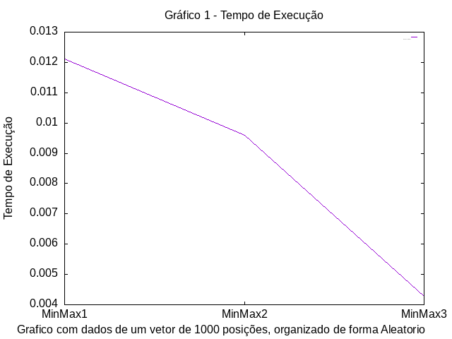

#  🎮 MinMax

<div align="center">
   
   
   
   
</div>

<details>
  <summary>📌 Tópicos</summary>
    <ol>
        <li><a href="#descricao">Descrição</a></li>
        <li><a href="#funcionalidades">Funcionalidades</a></li>
        <li><a href="#implementacao">Implementação</a></li>
        <li><a href="#estrutura-de-diretorios">Estrutura de Diretórios</a></li>
        <li><a href="#como-usar">Como Usar</a></li>
        <li><a href="#exemplos">Exemplos</a></li>
        <li><a href="#resultados-das-analises">Resultados Das Análises</a></li>
        <li><a href="#makefile">MakeFile</a></li>
        <li><a href="#contato">Contato</a></li>
    </ol>
</details>

## 📝 Descrição

Este projeto consiste em um conjunto de funções em C++ que implementam três algoritmos diferentes para encontrar o valor máximo e mínimo em um vetor de inteiros. Os algoritmos são:

- **MaxMin1:** Este algoritmo percorre o vetor uma vez para encontrar o máximo e o mínimo.
- **MaxMin2:** Similar ao MaxMin1, mas utiliza uma estrutura de controle diferente para verificar o máximo e o mínimo.
- **MaxMin3:** Este algoritmo utiliza uma abordagem em anéis para encontrar o máximo e o mínimo.

Além da implementação dos algoritmos, o programa realiza uma análise de desempenho abrangente. Cada algoritmo é executado 10 vezes para cada combinação de tamanho de vetor (1000, 10000, 100000, 500000) e configuração de ordenação (aleatório, crescente, decrescente). Os tempos de execução são registrados e a média dessas 10 execuções é calculada para cada caso. Os resultados dessas médias são armazenados em um arquivo CSV para posterior análise.

Posteriormente, são gerados gráficos a partir dos dados do arquivo CSV, permitindo uma visualização clara das diferenças de desempenho entre os algoritmos para diferentes cenários de entrada.

## ⚙️ Funcionalidades
O programa foi implementado em C++ e possui como objetivo principal analisar o desempenho de três algoritmos diferentes para encontrar o valor máximo e mínimo em um vetor de inteiros.

1. **Implementação dos Algoritmos**
- O programa inclui a implementação de três algoritmos diferentes para encontrar o valor máximo e mínimo em um vetor de inteiros.
- Cada algoritmo possui sua própria função (`MaxMin1`, `MaxMin2` e `MaxMin3`) e abordagem única para resolver o problema.

2. **Análise de Desempenho**
- O código executa uma análise de desempenho detalhada dos algoritmos.
- Cada algoritmo é executado 10 vezes para diferentes tamanhos de vetor (1000, 10000, 100000, 500000) e configurações de ordenação (aleatório, crescente, decrescente).
- Os tempos de execução são registrados e a média das 10 execuções é calculada para cada caso.
- Os resultados são armazenados em um arquivo `resultados.csv` para posterior análise e visualização.

3. **Geração de Gráficos**
- Com base nos dados do arquivo `resultados.csv`, o programa gera gráficos usando `GNUPLOT` para visualizar as diferenças de desempenho entre os algoritmos.
- Os gráficos fornecem uma representação visual clara das análises de desempenho realizadas.

4. **Estrutura do Código**
- O código está organizado em funções modulares que facilitam a compreensão e manutenção.
- Comentários são fornecidos ao longo do código para explicar a lógica e o propósito de cada parte importante do programa.


## 🛠️ Implementação dos Algoritmos MaxMin
Os algoritmos `MaxMin1`, `MaxMin2` e `MaxMin3` são implementados para resolver o problema de encontrar o máximo e o mínimo em um vetor de forma eficiente.

1. **MaxMin1:** O algoritmo `MaxMin1` percorre o vetor uma única vez para encontrar o valor máximo e mínimo. Ele inicializa as variáveis Max e Min com o valor do segundo elemento do vetor e, em seguida, percorre o restante do vetor comparando cada elemento com Max e Min e atualizando-os conforme necessário.
``` cpp
    void MaxMin1(int A[], int n, int &Max, int &Min) {
        Max = A[1];
        Min = A[1];
        for (int i = 1; i < n; ++i) {
            if (A[i] > Max) {
                Max = A[i];
            }
            if (A[i] < Min) {
                Min = A[i];
            }
        }
    }
```

2. **MaxMin2:** O algoritmo `MaxMin2` é semelhante ao `MaxMin1`, mas utiliza uma estrutura de controle diferente. Ele também percorre o vetor uma única vez e compara cada elemento com Max e Min, mas utiliza uma estrutura if-else para verificar se o elemento é maior que Max ou menor que Min.
``` cpp
    void MaxMin2(int A[], int n, int &Max, int &Min) {
        Max = A[1];
        Min = A[1];
        for (int i = 1; i < n; i++) {
            if (A[i] > Max) {
                Max = A[i];
            } else if (A[i] < Min) {
                Min = A[i];
            }
        }
    }
```

3. **MaxMin:** O algoritmo MaxMin3 utiliza uma abordagem em anéis para encontrar o valor máximo e mínimo. Ele é projetado para lidar com vetores de tamanho ímpar e par de forma eficiente, garantindo que todos os elementos do vetor sejam comparados entre si.
``` cpp
    void MaxMin3(int A[], int n, int &Max, int &Min) {
        int i, FimDoAnel;

        if (n % 2 > 0) {
            A[n + 1] = A[n];
            FimDoAnel = n;
        } else {
            FimDoAnel = n - 1;
        }

        if (A[1] > A[2]) {
            Max = A[1];
            Min = A[2];
        } else {
            Max = A[2];
            Min = A[1];
        }

        i = 3;
        while (i <= FimDoAnel) {
            if (A[i] > A[i + 1]) {
                if (A[i] > Max) {
                    Max = A[i];
                }
                if (A[i + 1] < Min) {
                    Min = A[i + 1];
                }
                if (A[i + 1] > Max) {
                    Max = A[i + 1];
                }
                if (A[i] < Min) {
                    Min = A[i];
                }
            }
            i = i + 2;
        }
    }
```

## Medição e Armazenamento do Tempo de Execução
Para avaliar o desempenho dos algoritmos de busca do valor máximo e mínimo em um vetor, foram realizadas medições precisas do tempo de execução. Essas medições foram feitas utilizando a biblioteca `<chrono>` do C++, que oferece uma maneira confiável de medir tempos em alta resolução. O tempo de execução de cada algoritmo foi medido em diferentes cenários, incluindo diferentes tamanhos de vetor e diferentes configurações de ordenação. Os resultados foram registrados em um arquivo CSV, fornecendo uma base de dados para análise detalhada do desempenho de cada algoritmo em diversas condições. A função `execucao` que está no arquivo `minMax.cpp` é responsável por realizar a execução dos algoritmos, medir o tempo de execução e armazenar os resultados.

1. **Definição de Variáveis e Loops Externos**
    - Nesta parte, são definidas as variáveis necessárias para controlar o tamanho do vetor (`n`), o tempo de execução médio (`tempoExecMedio`) e as strings para armazenar informações sobre a ordem do vetor e o algoritmo utilizado.

    - Em seguida, é iniciado um loop externo que percorre quatro diferentes tamanhos de vetores (1000, 10000, 100000, 500000). O valor de `n` é atualizado em cada iteração do loop de acordo com o tamanho do vetor atual.

    ```cpp
    void execucao(std::ofstream& file) {
        int n;
        int Max, Min;
        double tempoExecMedio;
        std::string ordem;
        std::string algoritmo; 

        for (int i = 0; i < 4; i++) { // são as quatro entradas diferentes
            if(i == 0) {
                n = 1000;
            } else if(i == 1) {
                n = 10000;
            } else if(i == 2) {
                n = 100000;
            } else if(i == 3) {
                n = 500000;
            }
    ```

2. **Alocação e Ordenação do Vetor**
    - Dentro do loop externo, um novo vetor `A` é alocado dinamicamente com o tamanho determinado por `n`.

    - Em seguida, um loop interno percorre três diferentes tipos de organização do vetor: `Aleatório`, `Crescente` e `Decrescente`.

    - Dependendo do tipo de organização (`j`), o vetor é preenchido com valores aleatórios ou com valores crescentes/decrescentes e, em seguida, é ordenado utilizando a função `std::qsort`.

    ```cpp
            int* A = new int[n]; // Aloca um novo vetor com o tamanho determinado
            for (int j = 0; j < 3; j++) { // são os três tipos de organização do vetor
                // Preencher e ordenar o vetor conforme necessário
                if(j == 1) {
                    for (int k = 0; k < n; k++) {
                        A[k] = k;
                    }
                    std::qsort(A, n, sizeof(int), compare);
                } else if(j == 2) {
                    for (int k = 0; k < n; k++) {
                        A[k] = n - k;
                    }
                    std::qsort(A, n, sizeof(int), compare);
                }
    ```

3. **Execução dos Algoritmos e Medição do Tempo de Execução**
    - Dentro do loop interno, cada um dos três algoritmos (`MaxMin1`, `MaxMin2` e `MaxMin3`) é executado 10 vezes para cada tipo de organização do vetor.

    - O tempo de execução de cada execução é medido utilizando a biblioteca `<chrono>`.

    - Após a execução dos algoritmos, o tempo de execução médio é calculado dividindo-se o total pelo número de execuções.
    
    - Os resultados são então armazenados em um arquivo CSV (`resultados.csv`) junto com informações sobre o tamanho do vetor, a organização do vetor e o número do algoritmo.
   
    - Finalmente, a memória alocada para o vetor `A` é liberada antes de encerrar a função.

    ```cpp
                    for (int k = 0; k < 3; k++) { // são os três tipos de algoritmos
                    for (int l = 0; l < 10; l++) { // são as 10 execuções de cada um
                        auto inicio = std::chrono::high_resolution_clock::now();
                        if(k == 0) {
                            MaxMin1(A, n, Max, Min);
                        } else if(k == 1) {
                            MaxMin2(A, n, Max, Min);
                        } else if(k == 2) {
                            MaxMin3(A, n, Max, Min);
                        }              
                        auto fim = stGeração de Gráficosd::chrono::high_resolution_clock::now();
                        std::chrono::duration<double, std::milli> tempoExec = (fim - inicio);

                        tempoExecMedio += tempoExec.count();
                        if(j == 0) {
                            ordem = "Aleatorio";
                        } else if(j == 1) {
                            ordem = "Crescente";
                        } else if(j == 2) {
                            ordem = "Decrescente";
                        }
                    }
                    
                    tempoExecMedio = tempoExecMedio / 10;
                    file << n << "," << ordem << "," << k+1 << "," << tempoExecMedio << "\n";
                    tempoExecMedio = 0;
                }
            }
            delete[] A; // Libera a memória alocada para A dentro do loop
        }
    }
    ```

## Geração de Gráficos Gnuplot
A geração de gráficos é uma etapa crucial para visualizar e interpretar os resultados obtidos a partir da execução dos algoritmos. Isso é feito utilizando uma ferramenta de plotagem, como o Gnuplot. O processo envolve as seguintes etapas:

1. **Arquivo resultados.csv:** O arquivo resultados.csv é um arquivo CSV (Comma-Separated Values) que armazena os resultados da execução dos algoritmos em diferentes cenários. Cada linha do arquivo contém dados relacionados a uma execução específica do algoritmo, e os dados são organizados da seguinte forma:

    - *Tamanho do vetor (`n`):* Representa o tamanho do vetor utilizado na execução do algoritmo.
    
    - *Tipo de organização do vetor:* Indica se o vetor foi organizado de forma aleatória, crescente ou decrescente.

    - *Número do algoritmo:* Identifica qual algoritmo foi executado. No exemplo fornecido, os valores possíveis são 1, 2 e 3, correspondendo aos algoritmos `MaxMin1`, `MaxMin2` e `MaxMin3`, respectivamente.
    
    - *Tempo de execução médio:* Representa o tempo médio de execução do algoritmo, medido em segundos.

2. **Código para Geração de Gráficos (plot_grafico.gp):** Para uma análise visual dos resultados obtidos a partir da execução dos algoritmos, são gerados gráficos que representam o tempo de execução em diferentes cenários. Esses gráficos são gerados a partir dos dados contidos no arquivo resultados.csv, onde cada linha representa uma execução específica dos algoritmos.

    - *Definição do Terminal de Saída:* O código define o formato de saída dos gráficos como PNG.

    - *Determinação do Número Total de Linhas no Arquivo:* Utiliza o comando do sistema `wc` para contar o número total de linhas no arquivo `resultados.csv`. Isso permite determinar quantos gráficos serão gerados.
        ```gnuplot
            set terminal png

            # Número de linhas a serem plotadas em cada gráfico
            linhas_por_grafico = 3

            # Número total de linhas no arquivo
            total_linhas = system('wc -l < "../datasets/resultados.csv"')
        ```
    - *Definição da Função para Plotar os Dados:* A função `plotar_dados` é responsável por gerar um script Gnuplot para plotar os dados de tempo de execução em um gráfico. Ela recebe vários parâmetros que são essenciais para a criação do script Gnuplot:
        - `linha_inicial`: Representa a linha inicial dos dados a serem plotados.
        - `linha_final`: Representa a linha final dos dados a serem plotados.
        - `indice`: Índice do gráfico, utilizado para identificar cada gráfico gerado.
        - `n`: Tamanho do vetor utilizado na execução do algoritmo.
        - `tipo`: Tipo de organização do vetor (aleatório, crescente, decrescente).
        ```gnuplot
            # Define a função para plotar os dados 
            plotar_dados(linha_inicial, linha_final, indice, n, tipo) = sprintf("set terminal png\nset output '../plots/grafico_%d.png'\nset datafile separator \",\"\nset title \"Gráfico %d - Tempo de Execução\"\nset xlabel \" \"\nset ylabel \"Tempo de Execução\"\nset xtics (\"MinMax1\" 1, \"MinMax2\" 2, \"MinMax3\" 3)\nset label 1 \"Grafico com dados de um vetor d'e %s posições, organizado de forma %s\" at graph -0.132, -0.095 \nplot \"../datasets/resultados.csv\" every ::%d::%d using 3:4 with lines title \"Tempo de Execução\"", indice, indice, n, tipo, linha_inicial, linha_final)
        ```

        A função então utiliza esses parâmetros para formatar um script Gnuplot que plota os dados correspondentes ao intervalo de linhas especificado. Ela define vários parâmetros do gráfico, como título, rótulos dos eixos e estilo das linhas.
        - Exemplo de Script Gnuplot Gerado pela função `plotar_dados`:
            - O gráfico é salvo como `grafico_1.png` na pasta `../plots/`.
            - Os dados são lidos do arquivo `resultados.csv` e apenas as linhas de 1 a 3 são consideradas.
            - O gráfico tem um título descritivo, rótulos nos eixos x e y, e um rótulo adicional explicando o contexto dos dados.
            - As linhas de dados são plotadas com estilo de linha contínua.
            ```gnuplot
                set terminal png
                    set output '../plots/grafico_1.png'
                    set datafile separator ","
                    set title "Gráfico 1 - Tempo de Execução"
                    set xlabel " "
                    set ylabel "Tempo de Execução"
                    set xtics ("MinMax1" 1, "MinMax2" 2, "MinMax3" 3)
                    set label 1 "Gráfico com dados de um vetor de 1000 posições, organizado de forma Aleatória" at graph -0.132, -0.095
                    plot "../datasets/resultados.csv" every ::1::3 using 3:4 with lines title "Tempo de Execução"
            ``` 

    - *Loop para Geração de Scripts e Gráficos:* Um loop percorre o arquivo `resultados.csv` em incrementos de linhas. Para cada conjunto de dados, um script Gnuplot é gerado chamando a função `plotar_dados`.

        1. *Definição do Intervalo de Linhas:* este loop percorre o intervalo de valores de `linha`, iniciando em 0 e indo até `total_linhas-linhas_por_grafico`, avançando de `linhas_por_grafico` em `linhas_por_grafico`. Cada iteração do loop processará um conjunto de linhas de dados do arquivo `resultados.csv`.
            ```gnuplot
                do for [linha = 0:total_linhas-linhas_por_grafico:linhas_por_grafico] {
            ``` 

        2. *Obtenção dos Dados:* Para cada iteração do loop, é determinada a linha inicial `linha_dados` a partir do valor de `linha`. Em seguida, são obtidos os dados relevantes para a geração do gráfico a partir do arquivo `resultados.csv`. O tamanho do vetor `n` e o tipo de organização do vetor `tipo` são extraídos da linha especificada.
            ```gnuplot
                linha_dados = linha + 1  # A linha dos dados na planilha começa do 1, não do 0
                n = system(sprintf("awk -F',' 'NR==%d{print $1}' ../datasets/resultados.csv", linha_dados))
                tipo = system(sprintf("awk -F',' 'NR==%d{print $2}' ../datasets/resultados.csv", linha_dados))
            ``` 
        
        3. *Cálculo dos Índices e do Nome do Script:*  São calculadas a linha inicial `linha_inicial` e a linha final `linha_final` do conjunto de dados a ser plotado. O índice do gráfico `indice` é calculado com base no número de linhas por gráfico. Além disso, é gerado um nome único para o script Gnuplot correspondente ao gráfico atual.
            ```gnuplot
                linha_inicial = linha
                linha_final = (linha -1) + linhas_por_grafico
                indice = linha / linhas_por_grafico + 1
                script_nome = sprintf("script_%d.gp", indice)
            ``` 

        4. *Gerção do Script Gnuplot:* A função `plotar_dados` é chamada para gerar o script Gnuplot específico para o conjunto de dados atual. Esta função cria um script formatado com base nos parâmetros fornecidos.
            ```gnuplot
                script = plotar_dados(linha_inicial, linha_final, indice, n, tipo)
            ``` 

        5. *Impressão do Script em um Arquivo:* O script Gnuplot gerado é impresso em um arquivo com o nome correspondente ao `script_nome`.
            ```gnuplot
                set print script_nome
                print script
                set print
            ``` 

        6. *Execução do Script Gnuplot:* O script Gnuplot é executado pelo Gnuplot, o que resulta na geração do gráfico correspondente ao conjunto de dados processado.
            ```gnuplot
                system(sprintf("gnuplot %s", script_nome))
            ``` 

    - *Limpeza dos Scripts Gerados:* Após a geração dos gráficos, os scripts Gnuplot gerados são removidos para manter a organização do ambiente de trabalho. 
        ```gnuplot
            # Apaga os scripts gerados após a execução
            system("rm script_*.gp")    
        ``` 

## 📂 Estrutura de Diretórios

O projeto é organizado da seguinte forma:

```
├── build
│   │   ├── objects
│   │   |   ├── src
│   │   |   |   ├── minMax.o
│   │   |   |   └── main.o
│   │   |   └── app
├── datasets
│   │   └── resultados.csv
├── plots
│   │   ├── grafico_1.png
│   │   ├── grafico_2.png
│   │   ├── grafico_3.png
│   │   ├── grafico_4.png
│   │   ├── grafico_5.png
│   │   ├── grafico_6.png
│   │   ├── grafico_7.png
│   │   ├── grafico_8.png
│   │   ├── grafico_9.png
│   │   ├── grafico_10.png
│   │   ├── grafico_11.png
│   │   └── grafico_12.png
├── src
│   │   ├── main.cpp
│   │   ├── minMax.cpp
│   │   ├── minMax.hpp
│   │   └── plot_script.gp
├── makefile
└── README.md
```
Esta estrutura de diretórios facilita a organização do projeto e a localização dos arquivos necessários para compilar o código-fonte, executar o programa e visualizar os resultados.

## 📚 Como Usar

1. Clone este repositório:

    ```bash
    git clone https://github.com/dudatsouza/minMax.git

2. Antes de compilar o programa, é recomendado executar o comando `make clean` para garantir que todos os arquivos compilados anteriores sejam removidos:

    ```bash
    make clean
    ```

3. Em seguida, compile o programa usando o Makefile:

    ```bash
    make
    ```

4. Execute o programa, fornecendo o nome do arquivo de entrada:

    ```bash
    make run 
    ```

5. Os gráficos gerados serão salvos na pasta `plots`. Você pode visualizá-los para analisar o desempenho dos algoritmos para diferentes tamanhos de vetores e organizações.

## 📋 Exemplos

### Parte do Arquivo `resultados.csv`:
 Aqui está uma amostra de parte do arquivo `resultados.csv`, que contém os dados utilizados para gerar os gráficos:
```cvs
1000,Aleatorio,1,0.0121099
1000,Aleatorio,2,0.0096047
1000,Aleatorio,3,0.0042907
1000,Crescente,1,0.0139565
1000,Crescente,2,0.0088651
1000,Crescente,3,0.0043848
1000,Decrescente,1,0.0181921
1000,Decrescente,2,0.0089584
1000,Decrescente,3,0.0042136
10000,Aleatorio,1,0.0964595
10000,Aleatorio,2,0.0905942
10000,Aleatorio,3,0.0416575
10000,Crescente,1,0.105026
10000,Crescente,2,0.0789313
10000,Crescente,3,0.0369203
10000,Decrescente,1,0.0857359
10000,Decrescente,2,0.0712279
10000,Decrescente,3,0.0385661
100000,Aleatorio,1,0.988458
100000,Aleatorio,2,0.895921
100000,Aleatorio,3,0.389495
100000,Crescente,1,0.832056
100000,Crescente,2,0.687374
100000,Crescente,3,0.353992
100000,Decrescente,1,0.942956
100000,Decrescente,2,0.59501
100000,Decrescente,3,0.314573
500000,Aleatorio,1,3.39628
500000,Aleatorio,2,3.4096
500000,Aleatorio,3,1.63503
500000,Crescente,1,4.62255
500000,Crescente,2,3.05039
500000,Crescente,3,1.68429
500000,Decrescente,1,4.12758
500000,Decrescente,2,3.20071
500000,Decrescente,3,1.76562
```

### Exemplo de Saída de um dos Gráficos:
A partir deste arquivo são plotados 12 gráficos, cada um pegando a diferença entre o tempo de execução dos três MaxMin. Aqui está um exemplo de um dos gráficos gerados a partir dos dados do arquivo: 
<p align="center">
    
</p>


**OBSERVAÇÃO:** Foram plotados um total de 12 gráficos, representando diferentes tamanhos de vetores e organizações, mostrando a variação do tempo de execução de acordo com o MinMax usado.

## Resultados das Análises
Após a execução do programa inúmeras vezes e a análises dos gráficos gerados, observamos os seguintes resultados:


## ⛏ Makefile

O Makefile é um utilitário que automatiza o processo de compilação e execução de programas. Aqui estão os principais comandos do Makefile para este projeto:

| Comando      | Descrição                               |
|--------------|-----------------------------------------|
| `make`       | Compila o programa.                     |
| `make run`   | Executa o programa com o arquivo de entrada fornecido. |
| `make clean` | Remove os arquivos compilados.          |

## 📧 Contato

Para mais informações ou sugestões, sinta-se à vontade para entrar em contato:

- ✉️ **E-mail**: [](mailto:dudateixeirasouza@gmail.com)
- 💼 **LinkedIn**: [](https://www.linkedin.com/in/maria-eduarda-teixeira-souza-2a2b3a254/)
- 📸 **Instagram**: [](https://www.instagram.com/dudat_18/)

Ficarei feliz em receber feedbacks, contribuições ou responder a quaisquer dúvidas que você possa ter sobre o programa. 
